# Secure AWS Architecture & Threat Detection Lab

## Overview
This project demonstrates the design, implementation, and validation of a secure AWS cloud environment built around core cybersecurity engineering principles: network segmentation, least privilege access control, centralized logging, and attack detection.

The lab was developed as a hands-on security engineering project to show how cloud infrastructure can be designed securely, monitored effectively, and validated through realistic attack simulation. The environment uses a custom AWS architecture with public and private subnets, IAM users and roles, CloudTrail logging, CloudWatch monitoring, and multiple test scenarios to confirm that security controls function as intended.

## Project Objectives
The goals of this lab were to:

- Design a segmented AWS environment with secure public and private network boundaries
- Enforce least privilege through IAM users and roles
- Centralize visibility into account and infrastructure activity
- Detect suspicious or high-risk behavior using CloudTrail and CloudWatch
- Validate the environment through realistic attack simulations

### Architecture Diagram
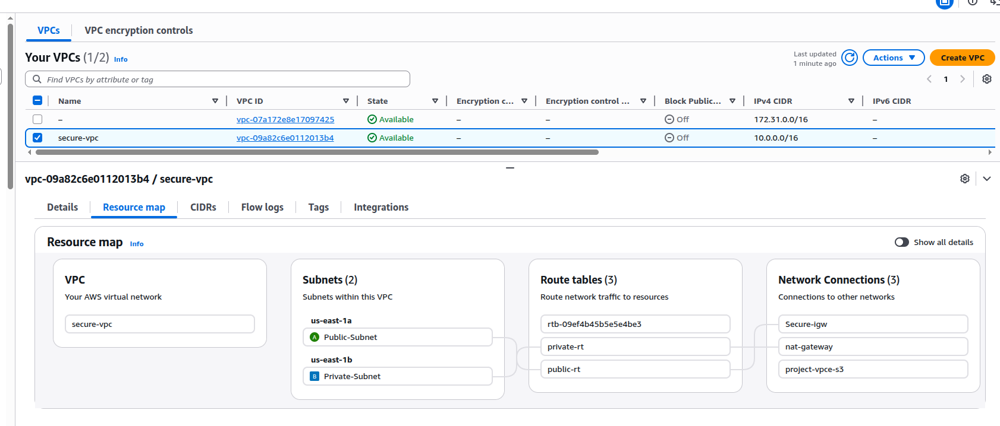

The lab environment consists of:

- A custom VPC (`10.0.0.0/16`)
- One public subnet
- One private subnet
- An Internet Gateway for public-facing access
- A NAT Gateway for controlled outbound traffic from the private subnet
- One public EC2 instance used as a bastion-style administrative host
- One private EC2 instance used as an internal backend system
- IAM user and role configurations for controlled AWS access
- CloudTrail and CloudWatch for centralized logging and monitoring

### Key Design Decisions
- Public-facing access was limited only to resources that required it
- The private EC2 instance was deployed without a public IP
- Outbound traffic from the private subnet was routed through a NAT Gateway
- Administrative access was restricted through security groups and least privilege principles
- Logging was enabled to provide visibility into user activity, IAM changes, and infrastructure events

## Network Design

### VPC and Subnets
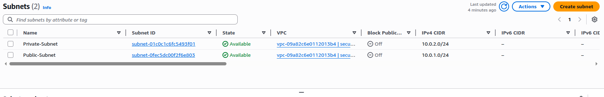

### Route Tables
Public Route-table

Private Route-table
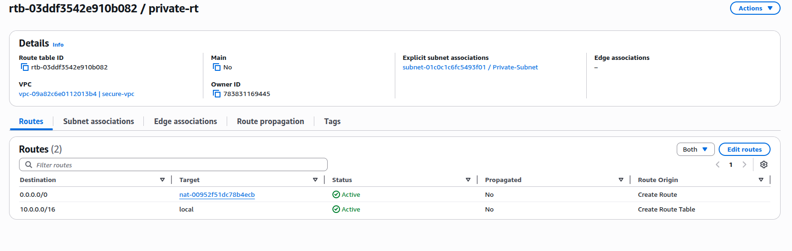

### NAT Gateway
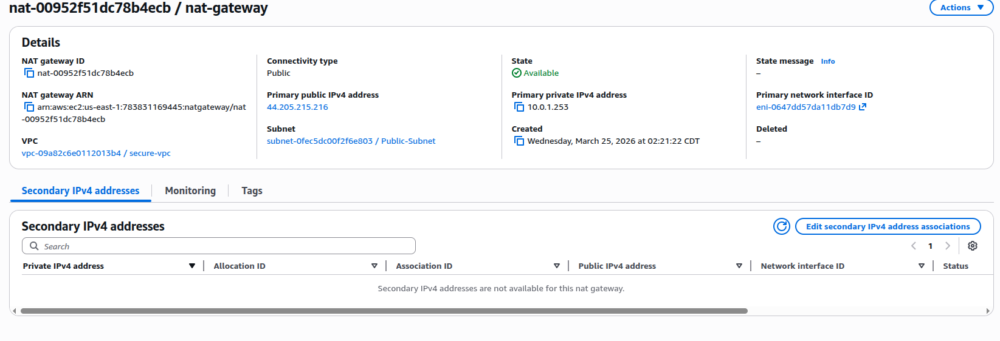

### Public and Private EC2 Instances
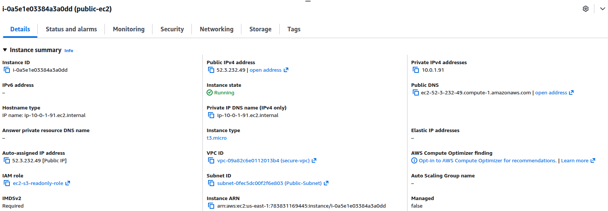

### Description

A custom VPC was created to isolate the lab from AWS default networking and allow full control over addressing, routing, and access design.

- VPC CIDR: `10.0.0.0/16`

#### Public Subnet
- Subnet CIDR: `10.0.1.0/24`
- Connected to Internet Gateway
- SSH restricted to user IP

#### Private Subnet
- Subnet CIDR: `10.0.2.0/24`
- No public IP assigned
- Outbound access through NAT Gateway only

#### Routing
- Public route table → Internet Gateway 
- Private route table → NAT Gateway 

## IAM & Access Control

### IAM User (Least Privilege)
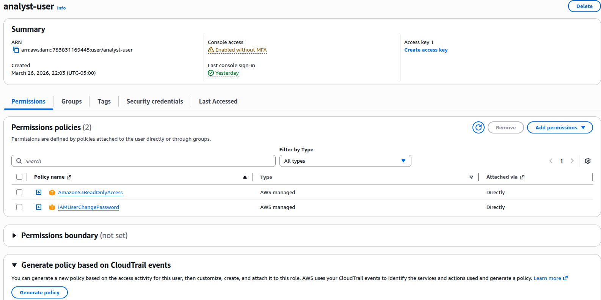

A restricted IAM user (`analyst-user`) was created with:

- `AmazonS3ReadOnlyAccess`

#### Validation
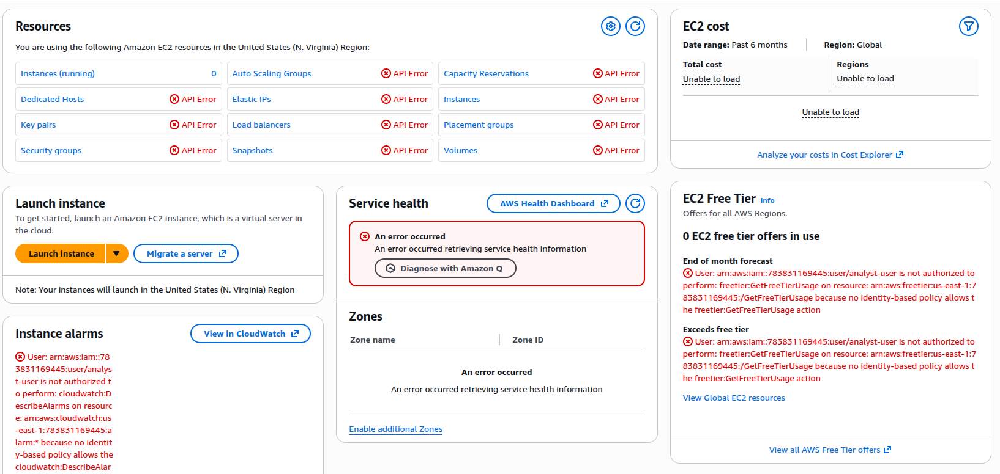

- Can view S3 resources
- Cannot modify infrastructure
- Cannot access IAM controls
- Requires new password

### IAM Role for EC2
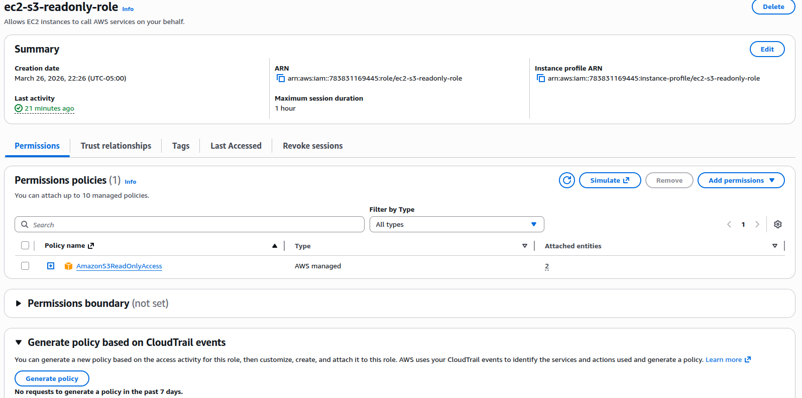

Role: `ec2-s3-readonly-role`

- Attached to EC2 instance
- Allows secure access to S3 without credentials

## Monitoring & Logging

### CloudTrail Setup
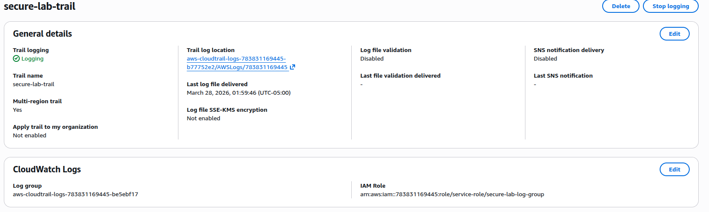

### CloudWatch Logs

### CloudWatch Alarm and Filter
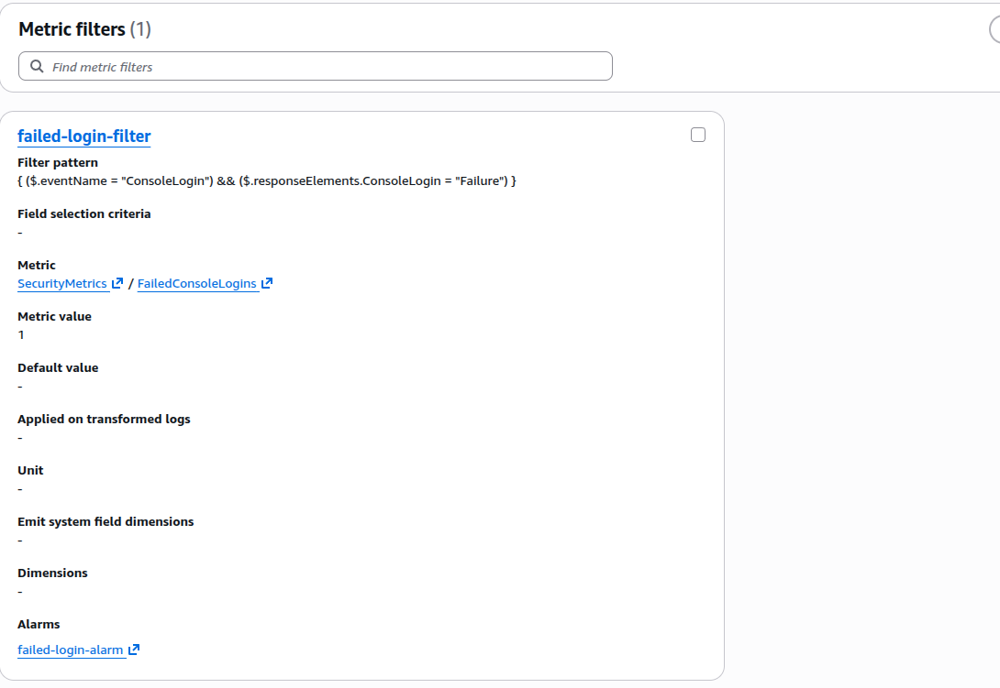
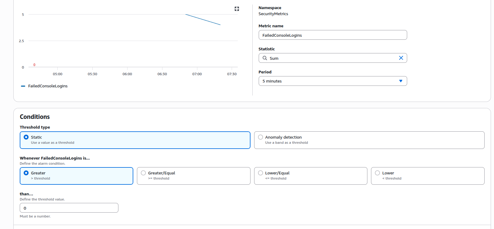

CloudTrail captures:
- Console logins
- API calls
- IAM changes
- Resource modifications

CloudWatch enables:
- Metric filters
- Alerts for suspicious activity

## Attack Simulation & Validation

### Failed Login Attack
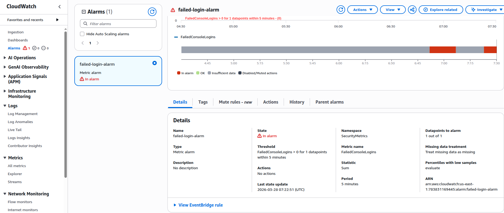
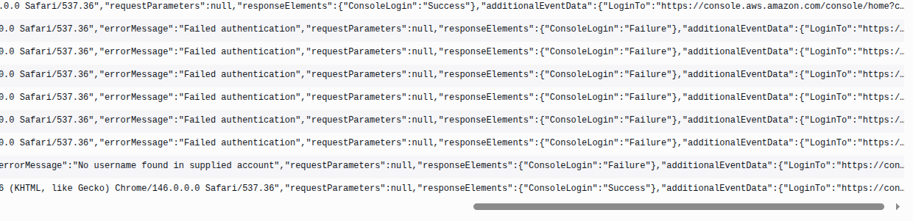

- Multiple failed login attempts generated
- Logged in CloudTrail
- Used to validate detection logic

### Privilege Escalation
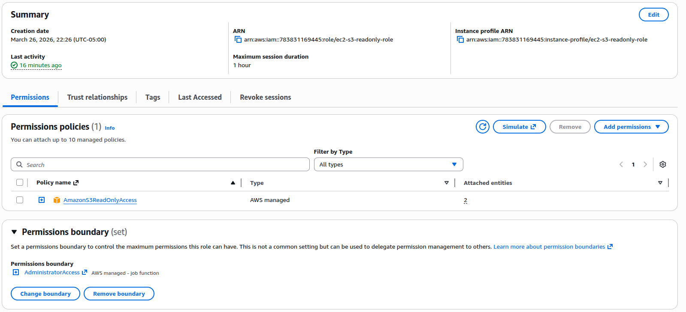

- Temporary admin policy attached
- Logged as:
  - AttachRolePolicy
  - DetachRolePolicy

### Unauthorized API Attempt
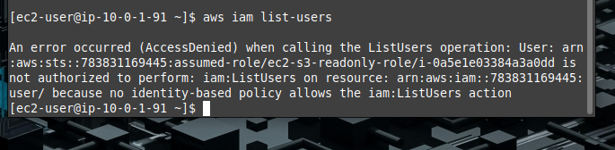

- Command attempted:
  aws iam list-users

## Conclusion

This project demonstrates the design and validation of a secure AWS environment built on core cybersecurity engineering principles. By combining network segmentation, IAM least privilege, centralized logging, and real-world attack simulation, the lab provides a practical example of how cloud systems can be both protected and monitored effectively.

Rather than focusing solely on deployment, this project emphasizes validation. Each control was tested through simulated attack scenarios to confirm that logging, detection, and access restrictions functioned as intended.

---

## Key Takeaways

- Security controls must be validated, not just implemented 
- Least privilege is critical to reducing attack surface 
- Network segmentation limits exposure and lateral movement 
- Logging and monitoring are essential for detection and response 
- IAM misconfigurations can introduce significant risk 
- Infrastructure actions (such as stopping instances) must be monitored alongside access events 

---

## Final Notes

This project reflects a shift from basic cloud usage to security-focused system design. It demonstrates the ability to think beyond configuration and toward securing, monitoring, and validating real-world environments.

Future work will focus on expanding detection capabilities, integrating SIEM tools, and automating response mechanisms.
